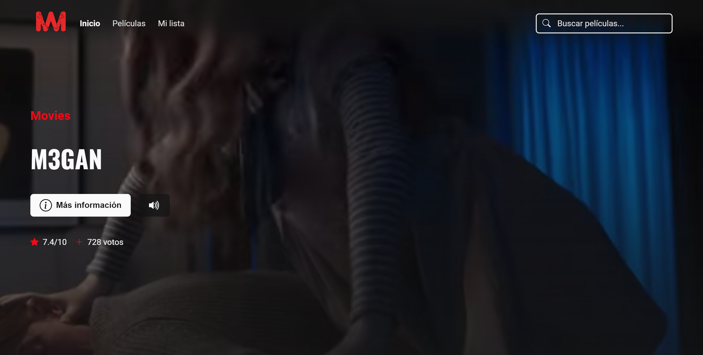
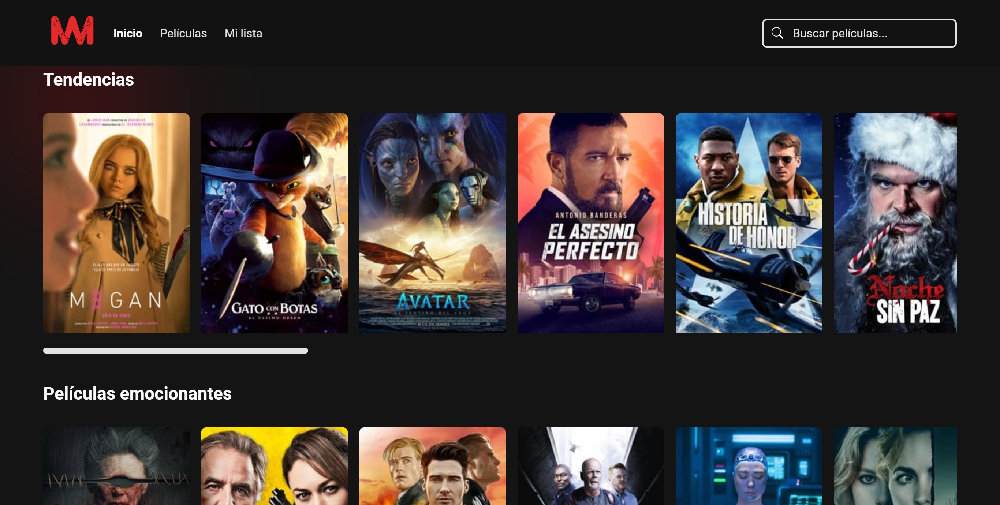
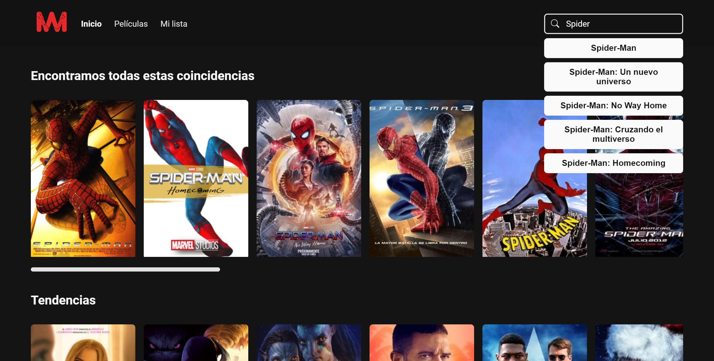

# Movies 📽️

Añade tus **películas favoritas** a tu lista y disfruta de las **nuevas tendencias** con toda su información en **Movies**.

👉 Enlace: [https://studiomovies.netlify.app/](https://studiomovies.netlify.app/)  
📢 Utilizando la API de: [themoviedb.org](https://developers.themoviedb.org/3/getting-started/introduction)  

  
  
  
  
  
  
  

## Películas

Las tendencias en películas a tu alcance.

## Modal de las películas

Toda la información y videos oficiales de cada una de ellas.

## Búsqueda de películas

Puedes buscar y tener sugerencias de la película que quieras.

## Tu lista

Tienes a disposición crear tu propia lista de películas para guardar.

